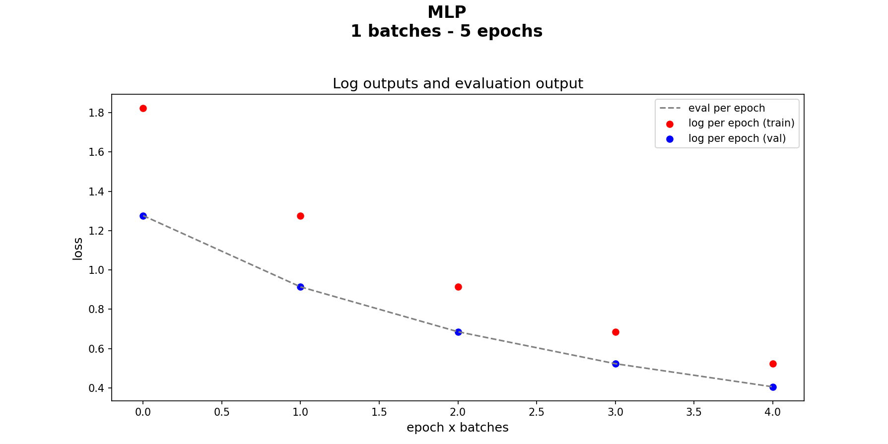
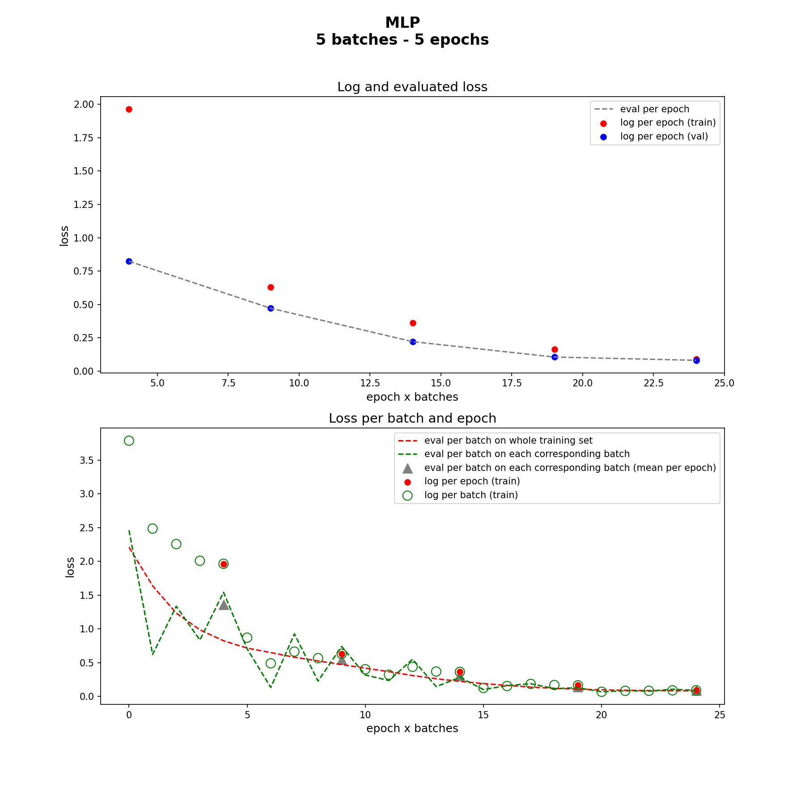
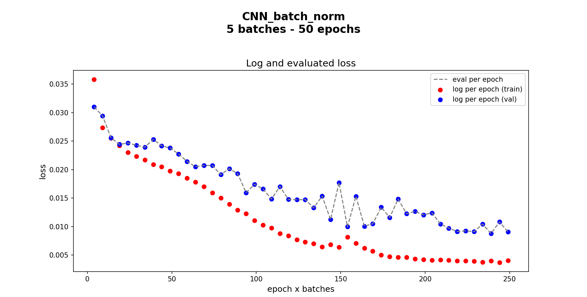
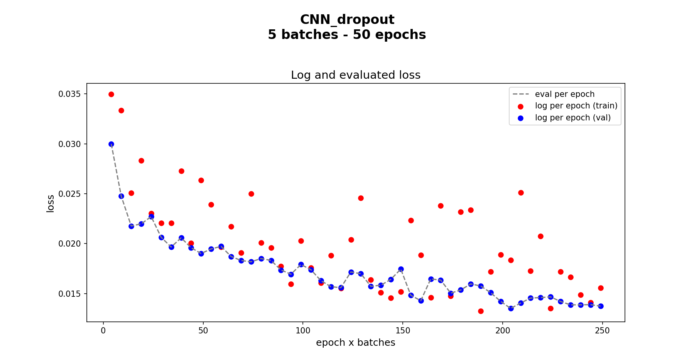

Discrepancy between output loss during training and loss calculated using weights
===============================

*1	Objective*
During regression using neural networks with the app Keras in Python, there is discrepancy between the loss yielded during training (stored in ‘logs’ and retrieved using, for instance, ‘model.history’) and the loss calculated from the weights after training (using the command ‘model.evaluate’). 
In Keras FAQS this issue is risen. It warns about regularization methods, which are reflected in loss, but not in validation loss. Also points out that the training loss is the average of the losses for each batch of training data, over the current epoch. 
Hence, in this work, these statements are studied by comparing loss values calculated in different ways.

*2	Datasets and models*
The input training dataset has 50 samples filled with 50 random numbers each. The output is dimension is 1 and it is generated using a mathematical function over the 50 numbers. After generating the output, noise is added to the input dataset.
The validation dataset is set equal to the training dataset.
Four model architectures are explored:
•	MLP (multi- layer perceptron)
•	CNN (convolutional neural network)
•	CNN + batch normalization (CNN regularized with batch normalization layers)
•	CNN + drop-out (CNN regularized with drop-out layers)
Shuffle of batches is set to False to study in detail the losses given after every batch.
The loss function is mean square error.

*3	Analysis*
Note 1 
Log loss: loss values calculated internally by Keras.
Evaluated loss: loss values obtained from the evaluation of weights after fitting a model.
Note 2
Tensorflow 1.15 and Tensorflow 2.4 give different results. The major difference is found in the log loss per batch. Here I report the results for Tensorflow 2.4.

3.1	Log loss: no regularization and one batch
If the training dataset is identical to the validation dataset, log loss values should be identical. However, this is not the case if regularization methods are implemented and/or training dataset is divided in batches. The following images show the results for a simple MLP without regularization and with only one batch. Blue and red scattered plots still differ. However, the only difference is that the blue dots (training loss) are delayed one epoch compared to the red dots (validation loss). 
The dashed line indicates the evaluated loss. The evaluation is performed over the model weights recorded after every epoch. These values coincide with the validation log loss. 
 

3.2	Log loss: no regularization layers and more than one batch
The following example is performed with an MLP with five (5) batches without regularization layer. As in the previous case with one batch, the evaluated loss is equal to the validation log loss, and the training and validation log losses differ. However, this time there is no clear relationship between them.
Training log loss after every batch (green void circles) is compared to the evaluated loss on every individual batch (dashed green line) and on the whole training set (dashed red line). Furthermore, the average batch loss over each epoch (grey triangles) were calculated from the evaluated loss on each individual batch. This was done in accordance to the statement: “the training loss that Keras displays is the average of the losses for each batch of training data, over the current epoch”.
Neither of the approaches to evaluate the loss coincide with the log loss. 

 

3.3	Log loss: regularization layers and more than one batch
The difference between training log loss and the actual values given by evaluating the resulting weights tend to reduce with epochs. Hence, this may not be a significant problem when analysing the accuracy of the model. 
When regularization is applied, the difference of training log loss with actual loss values may not get reduced with epochs. This is seen in the following figures where batch normalization and drop-out are used.
 
  
  

4	Conclusion 
When batch size is smaller than the training dataset, the log loss values differ from the actual loss values upon evaluation of the resulting model. This difference is accentuated by the use of regularization layers.
Hence, it is advised to evaluate the model after fitting to cross-check the log loss values. Furthermore, as log loss of the validation dataset is accurately determined, a subset of the training dataset can be used as input of the validation set for evaluation during model fitting,
